# 🎬 SumNot - YouTube to Notion Summarizer

<div align="center">


**Transform YouTube videos into organized Notion notes with AI-powered summaries**

[](https://render.com)
[](https://netlify.com)
[](https://opensource.org/licenses/MIT)

</div>

---

## ✨ Features

### 🎯 **Simple & User-Friendly**
- **One-click setup**: Connect to Notion with OAuth (no technical configuration needed)
- **Paste & go**: Just paste a YouTube URL and click "Create Notes"
- **Smart transcript extraction**: Automatically finds captions, including auto-generated ones

### 🤖 **AI-Powered Summarization**
- **Multiple AI providers**: OpenAI, Anthropic, Google Gemini, OpenRouter
- **1000+ models**: Access to all OpenRouter models with custom model selection
- **Intelligent summaries**: Key points, timestamps, and structured notes

### 📝 **Seamless Notion Integration**
- **Direct page selection**: Choose exactly where to save your notes
- **Rich formatting**: Organized with headers, bullet points, and timestamps
- **Instant sync**: Notes appear in your Notion workspace immediately

### 🚀 **Production Ready**
- **Secure deployment**: Environment-based configuration
- **Rate limiting**: Built-in protection against abuse
- **Error handling**: Comprehensive error messages and fallbacks
- **Responsive design**: Works perfectly on desktop and mobile

---

## 🎬 How It Works

```mermaid
graph LR
    A[📺 YouTube Video] --> B[🔍 Extract Transcript]
    B --> C[🤖 AI Summarization]
    C --> D[📝 Format Notes]
    D --> E[💾 Save to Notion]
    
    F[👤 User] --> G[🔗 Connect Notion]
    G --> H[⚙️ Configure AI]
    H --> I[🎯 Select Page]
    I --> A
```



1. **Connect**: Link your Notion account with one click
2. **Configure**: Set up your preferred AI provider and model
3. **Select**: Choose the Notion page where notes should be saved
4. **Summarize**: Paste any YouTube URL and get instant AI-generated notes

---

## 🛠️ Tech Stack

### Frontend
- **React 18** with TypeScript
- **Vite** for lightning-fast development
- **Tailwind CSS** for beautiful, responsive design
- **Framer Motion** for smooth animations
- **Shadcn/ui** components for consistent UI

### Backend
- **Node.js** with Express.js
- **YouTube Transcript API** for caption extraction
- **Multiple AI APIs** (OpenAI, Anthropic, Google, OpenRouter)
- **Notion API** for seamless integration
- **Security middleware** (Helmet, CORS, Rate Limiting)

### Deployment
- **Render** (recommended) or **Netlify** for hosting
- **Environment-based configuration**
- **Automatic SSL** and CDN

---

## 🚀 Quick Start

### Prerequisites
- Node.js 18+ and npm
- A Notion account
- An AI API key (OpenAI, Anthropic, Google, or OpenRouter)

### 1. Clone & Install
```bash
git clone https://github.com/yourusername/sumnot.git
cd sumnot

# Install backend dependencies
cd backend
npm install

# Install frontend dependencies
cd ../frontend
npm install
```

### 2. Environment Setup
```bash
# Backend (.env)
NOTION_CLIENT_ID=your_notion_client_id
NOTION_CLIENT_SECRET=your_notion_client_secret
NOTION_REDIRECT_URI=http://localhost:5000/api/notion/callback
FRONTEND_URL=http://localhost:3000
NODE_ENV=development

# Frontend (.env)
VITE_API_URL=http://localhost:5000
```

### 3. Run Development
```bash
# Terminal 1: Backend
cd backend
npm start

# Terminal 2: Frontend
cd frontend
npm run dev
```

Visit `http://localhost:3000` and start summarizing! 🎉

---

## 🌐 Deployment

### Option 1: Render (Recommended)

<details>
<summary>📋 Step-by-step Render deployment</summary>

#### Backend Deployment
1. **Create Web Service** on Render
2. **Connect your GitHub repository**
3. **Configure build settings**:
   - Build Command: `npm install`
   - Start Command: `npm start`
   - Environment: `Node`
4. **Add environment variables**:
   ```
   NOTION_CLIENT_ID=your_client_id
   NOTION_CLIENT_SECRET=your_client_secret
   NOTION_REDIRECT_URI=https://your-backend.onrender.com/api/notion/callback
   FRONTEND_URL=https://your-frontend.onrender.com
   NODE_ENV=production
   ```

#### Frontend Deployment
1. **Create Static Site** on Render
2. **Configure build settings**:
   - Build Command: `npm run build`
   - Publish Directory: `dist`
3. **Add environment variable**:
   ```
   VITE_API_URL=https://your-backend.onrender.com
   ```

#### Update Notion Integration
1. Go to your [Notion integration settings](https://www.notion.so/my-integrations)
2. Update **Redirect URI** to: `https://your-backend.onrender.com/api/notion/callback`

</details>

### Option 2: Netlify

<details>
<summary>📋 Netlify deployment guide</summary>

#### Backend (Railway/Heroku)
Deploy backend to Railway or Heroku, then deploy frontend to Netlify:

1. **Connect repository** to Netlify
2. **Build settings**:
   - Build Command: `npm run build`
   - Publish Directory: `dist`
3. **Environment variables**:
   ```
   VITE_API_URL=https://your-backend.railway.app
   ```

</details>

---

## 🔧 Configuration

### AI Provider Setup

| Provider | API Key Location | Popular Models |
|----------|------------------|----------------|
| **OpenAI** | [platform.openai.com/api-keys](https://platform.openai.com/api-keys) | GPT-4o, GPT-4o Mini |
| **Anthropic** | [console.anthropic.com](https://console.anthropic.com) | Claude 3.5 Sonnet, Claude 3 Haiku |
| **Google** | [makersuite.google.com/app/apikey](https://makersuite.google.com/app/apikey) | Gemini Pro 1.5 |
| **OpenRouter** | [openrouter.ai/keys](https://openrouter.ai/keys) | 1000+ models available |

### Notion Integration Setup

1. **Create Integration**:
   - Go to [notion.so/my-integrations](https://www.notion.so/my-integrations)
   - Click "New integration"
   - Copy **Client ID** and **Client Secret**

2. **Configure Redirect URI**:
   - Add your backend URL + `/api/notion/callback`
   - Example: `https://your-backend.onrender.com/api/notion/callback`

3. **Share Pages**:
   - Open any Notion page you want to use
   - Click "Share" → "Invite" → Add your integration

---

## 📱 Usage

### First Time Setup
1. **Visit the app** and go to **Settings**
2. **Choose AI provider** and enter your API key
3. **Select model** (for OpenRouter, you can enter any model name)
4. **Save settings**

### Creating Notes
1. **Go to Dashboard** and click "Connect to Notion"
2. **Authorize** the app in the Notion popup
3. **Select a page** where notes should be saved
4. **Go to Home** and paste a YouTube URL
5. **Click "Create Notes"** and wait for the magic! ✨

### Supported Videos
- ✅ **Public videos** with captions
- ✅ **Auto-generated captions** (automatically detected)
- ✅ **Multiple languages** (English preferred)
- ❌ **Private/unlisted videos**
- ❌ **Videos without captions**

---

## 🎨 Screenshots

<div align="center">

### 🏠 Home Page


### ⚙️ Settings


### 📊 Dashboard


</div>

---

## 🤝 Contributing

We welcome contributions! Here's how you can help:

### 🐛 Bug Reports
- Use the [GitHub Issues](https://github.com/yourusername/sumnot/issues) page
- Include steps to reproduce and expected behavior

### 💡 Feature Requests
- Open an issue with the "enhancement" label
- Describe the feature and its benefits

### 🔧 Development
1. **Fork the repository**
2. **Create a feature branch**: `git checkout -b feature/amazing-feature`
3. **Commit changes**: `git commit -m 'Add amazing feature'`
4. **Push to branch**: `git push origin feature/amazing-feature`
5. **Open a Pull Request**

### 📋 Development Guidelines
- Follow the existing code style
- Add tests for new features
- Update documentation as needed
- Ensure all builds pass

---

## 📄 License

This project is licensed under the MIT License - see the [LICENSE](LICENSE) file for details.

---

## 🙏 Acknowledgments

- **YouTube Transcript API** for caption extraction
- **Notion API** for seamless integration
- **OpenAI, Anthropic, Google** for AI capabilities
- **OpenRouter** for model access
- **Render & Netlify** for hosting platforms
- **Shadcn/ui** for beautiful components

---

## 📞 Support

- **Documentation**: [GitHub Wiki](https://github.com/yourusername/sumnot/wiki)
- **Issues**: [GitHub Issues](https://github.com/yourusername/sumnot/issues)
- **Discussions**: [GitHub Discussions](https://github.com/yourusername/sumnot/discussions)

---

<div align="center">

**Made with ❤️ for content creators and knowledge workers**

[⭐ Star this repo](https://github.com/yourusername/sumnot) • [🐛 Report Bug](https://github.com/yourusername/sumnot/issues) • [💡 Request Feature](https://github.com/yourusername/sumnot/issues)

</div>